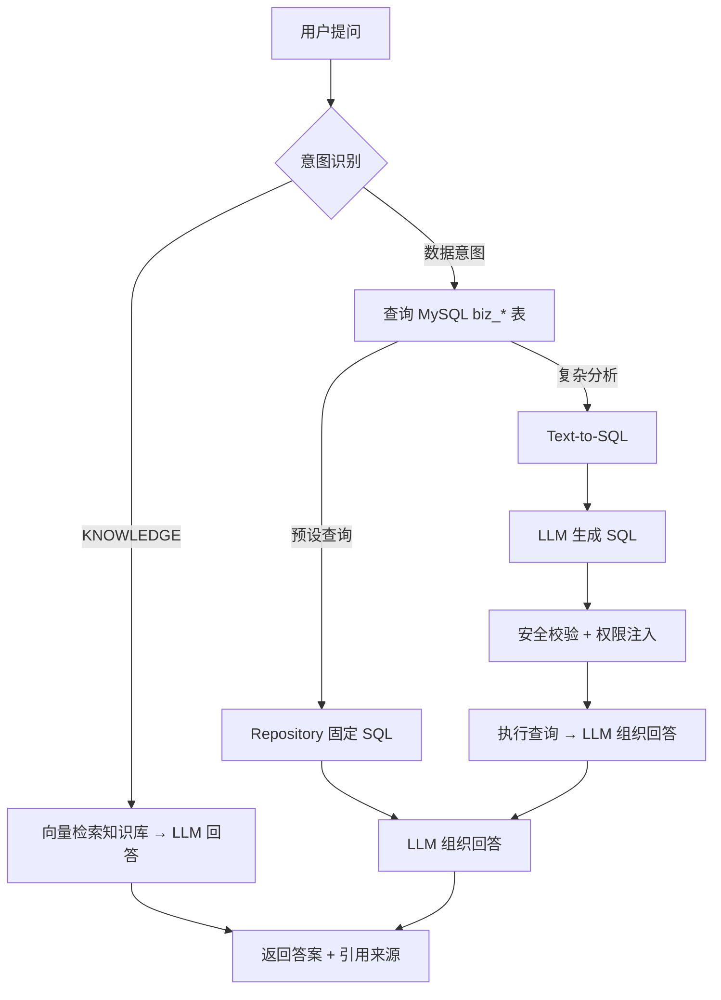

# HR AI 智能平台

企业级 HR 智能问答与预测分析系统。支持制度知识 RAG 问答、业务数据库实时查询、Text-to-SQL 复杂分析，以及管理者预测仪表盘与决策报告。

## 能力概览

| 层级 | 能力 | 技术方案 |
|------|------|----------|
| 核心能力层 | 员工自助查询、制度问答、管理者决策支持 | RAG + 预设查询 + Text-to-SQL |
| 进阶价值层 | 离职风险、技能缺口、招聘质量分析 | 预测数据 + LLM 解读 |
| 工程落地层 | 权限控制、数据隔离、连接池监控 | Spring Security + Druid + RBAC |

## 技术栈

| 模块 | 技术 |
|------|------|
| 后端 | Spring Boot 3.2、Java 17、Spring Security、JPA |
| 数据库 | MySQL 8.0 + **Druid** 连接池 |
| 大模型 | 通义千问 Qwen-Plus（OpenAI 兼容 API） |
| 前端 | Vue 3、Vite、Element Plus、Pinia、Axios |

## 项目结构

```
ai_query/
├── backend/                    # Spring Boot 后端
│   └── src/main/java/com/hr/ai/
│       ├── controller/         # REST API（Auth / Chat / Analytics / Knowledge）
│       ├── service/            # 业务逻辑（RAG、LLM、预测、HR 查询）
│       │   └── texttosql/      # Text-to-SQL 子系统（Prompt / 安全 / 执行）
│       ├── security/           # JWT 认证 + 角色权限
│       ├── config/             # 数据初始化（用户 / 业务表 / 知识库）
│       └── model/entity/       # 平台表 + biz_* 业务表实体
├── frontend/                   # Vue 3 前端
│   └── src/
│       ├── views/              # 问答、分析、报告、知识库
│       ├── api/                # Axios 封装
│       ├── stores/             # Pinia 用户状态
│       └── router/             # 路由与权限守卫
└── scripts/mysql/
    └── hr_test_data.sql        # MySQL 业务测试数据脚本
```

## 快速启动

### 环境要求

- JDK 17+
- Maven 3.8+
- Node.js 18+
- MySQL 8.0+

### 1. 准备数据库

**方式 A — 导入完整测试数据（推荐）**

```bash
mysql -u root -p < scripts/mysql/hr_test_data.sql
```

脚本会自动创建 `hr_ai` 库，并写入 `biz_*` 业务表及演示数据。

**方式 B — 仅创建空库（业务数据由应用自动初始化）**

```sql
CREATE DATABASE hr_ai DEFAULT CHARACTER SET utf8mb4 COLLATE utf8mb4_unicode_ci;
```

应用启动后，`DataInitializer` 会写入登录用户与知识库；`BizDataInitializer` 在 `biz_employee` 为空时自动加载演示业务数据。

### 2. 配置数据库连接

编辑 `backend/src/main/resources/application.yml`：

```yaml
spring:
  datasource:
    url: jdbc:mysql://localhost:3306/hr_ai?useSSL=false&serverTimezone=Asia/Shanghai&characterEncoding=utf8&allowPublicKeyRetrieval=true
    username: root
    password: 你的密码
```

### 3. 配置大模型（可选）

未配置 API Key 时自动使用 Mock 模式（本地模板回答）。

```powershell
# Windows PowerShell
$env:LLM_API_KEY="sk-你的API密钥"
```

或在 `application.yml` 中设置 `hr.ai.llm.api-key`。

### 4. 启动服务

```bash
# 后端（端口 8080）
cd backend
mvn spring-boot:run

# 前端（端口 5173）
cd frontend
npm install
npm run dev
```

| 服务 | 地址 |
|------|------|
| 前端 | http://localhost:5173 |
| 后端 API | http://localhost:8080 |
| Druid 监控 | http://localhost:8080/druid/ （admin / admin123） |
| 健康检查 | http://localhost:8080/api/health |

## 演示账号

| 角色 | 用户名 | 密码 | 员工编号 | 权限 |
|------|--------|------|----------|------|
| 普通员工 | employee1 | 123456 | E001 | 智能问答、个人数据查询 |
| 部门经理 | manager1 | 123456 | E002 | + 预测分析、决策报告（本部门） |
| HRBP | hrbp1 | 123456 | E003 | + 全公司 HR 数据 |
| 管理员 | admin | 123456 | E000 | + 知识库管理 |

## 智能问答：何时查数据库？

用户提问后，系统通过意图识别自动路由：

```
用户提问
  ├─ 制度/政策类（年假怎么申请？）        → 知识库 RAG
  ├─ 个人/部门简单数据（我的假期余额？）   → 预设 SQL 查询
  └─ 复杂分析（各部门加班排名对比？）      → Text-to-SQL（LLM 生成 SQL）
```

| 路径 | 触发示例 | 说明 |
|------|----------|------|
| 知识库 RAG | 五险一金怎么缴、离职流程 | 检索 `knowledge_documents` |
| 预设查询 | 我的加班时长、部门离职风险 | 关键词 + Repository 固定查询 |
| Text-to-SQL | 对比各部门加班排名、绩效C且加班>50h | LLM 生成 SQL + 安全校验 + 自纠错 |

## 业务数据表（biz_*）

| 表名 | 内容 |
|------|------|
| `biz_department` | 部门信息 |
| `biz_employee` | 员工档案 |
| `biz_attendance` | 考勤汇总（2026-Q1） |
| `biz_salary` | 薪酬数据（敏感，仅 HRBP/管理员） |
| `biz_performance` | 绩效记录 |
| `biz_turnover_risk` | 离职风险预测 |

## 核心 API

| 接口 | 方法 | 说明 | 权限 |
|------|------|------|------|
| `/api/auth/login` | POST | 登录 | 公开 |
| `/api/auth/me` | GET | 当前用户信息 | 已登录 |
| `/api/chat/ask` | POST | 智能问答 | 已登录 |
| `/api/chat/sessions` | GET | 会话列表 | 已登录 |
| `/api/analytics/dashboard` | GET | 预测分析仪表盘 | 管理者+ |
| `/api/analytics/turnover` | GET | 离职风险 | 管理者+ |
| `/api/analytics/skill-gaps` | GET | 技能缺口 | 管理者+ |
| `/api/analytics/recruitment` | GET | 招聘质量 | 管理者+ |
| `/api/reports/generate` | POST | 管理者决策报告 | 管理者+ |
| `/api/knowledge` | CRUD | 知识库管理 | 管理员 |
| `/api/health` | GET | 健康检查 | 公开 |

## 架构说明

### 问答流程



### Text-to-SQL 安全链

Text-to-SQL 的用户查询安全由应用层独立保障（不依赖 Druid WallFilter）：

1. 仅允许 `SELECT`，白名单 6 张 `biz_*` 表
2. 禁止 DML/DDL/UNION/注释
3. 自动注入角色级 `employee_id` / `dept_id` 过滤
4. 强制 `LIMIT` 上限（默认 100 行）
5. SQL 执行失败时 LLM 自纠错重试（默认 2 次）

### 预测分析

当前为演示数据（`DataInitializer` 种子），生产环境可对接 XGBoost / 随机森林等 ML 模型：

- **离职风险**：综合绩效、考勤、满意度等维度评分
- **技能缺口**：岗位技能供需与缺口分析
- **招聘质量**：成功入职者特征与优化建议

### 安全与权限

- JWT 无状态认证
- 基于角色的访问控制（RBAC）：EMPLOYEE / MANAGER / HRBP / HR_ADMIN
- 部门级数据隔离（经理仅看本部门）
- 薪酬等敏感字段额外权限校验

## 配置参考

### 大模型（通义千问）

| 配置项 | 默认值 | 说明 |
|--------|--------|------|
| `hr.ai.llm.provider` | `qwen` | `qwen` 或 `mock` |
| `hr.ai.llm.api-key` | 环境变量 `LLM_API_KEY` | 未配置时回退 Mock |
| `hr.ai.llm.model` | `qwen-plus` | 可改为 `qwen-max` 等 |
| `hr.ai.llm.temperature` | `0.3` | 越低越稳定 |

获取 API Key：[阿里云百炼控制台](https://bailian.console.aliyun.com/) → API-KEY 管理

### Text-to-SQL

| 配置项 | 默认值 | 说明 |
|--------|--------|------|
| `hr.ai.text-to-sql.enabled` | `true` | 是否启用 |
| `hr.ai.text-to-sql.max-rows` | `100` | 单次最大返回行数 |
| `hr.ai.text-to-sql.few-shot-enabled` | `true` | Prompt 中包含示例 SQL |
| `hr.ai.text-to-sql.self-correction-enabled` | `true` | 执行失败时 LLM 自纠错 |
| `hr.ai.text-to-sql.max-retries` | `2` | 自纠错最大重试次数 |

### Druid 连接池

| 配置项 | 默认值 | 说明 |
|--------|--------|------|
| `spring.datasource.type` | `DruidDataSource` | 唯一数据源连接方式 |
| `spring.datasource.druid.max-active` | `30` | 最大连接数 |
| `spring.datasource.druid.stat-view-servlet.enabled` | `true` | 开启监控页面 |

### HR 系统集成（可选）

```yaml
hr:
  ai:
    integration:
      enabled: true
      provider: beisen    # sap / beisen / moka
      base-url: https://your-hr-system.com/api
```

默认关闭，数据直接来自 MySQL `biz_*` 表。

## 常见问题

**Q: 启动报「未找到员工 E00x」？**

确保 `biz_employee` 有数据：导入 `hr_test_data.sql`，或清空业务表后重启让 `BizDataInitializer` 自动初始化。

**Q: 启动报 DDL / CLOB 相关错误？**

确认使用 MySQL 8.0+，且数据库为 `hr_ai`。若之前启动失败留下不完整表结构，建议 `DROP DATABASE hr_ai` 后重建。

**Q: 问答没有走数据库，只查了知识库？**

检查问题是否包含数据类关键词（「我的」「加班」「统计」等）。制度类问题默认走 RAG，不会查库。

**Q: Text-to-SQL 回答不准确？**

确认已配置 Qwen API Key（Mock 模式仅支持少量预设模板）。复杂问题建议用 manager1 或 hrbp1 账号测试。

## 生产部署建议

1. MySQL 主从或云数据库，关闭 `ddl-auto: update`，改用 Flyway/Liquibase 管理表结构
2. 向量库升级为 Milvus / pgvector，替换当前 Jaccard 轻量检索
3. LLM 使用企业级 API 或私有化部署
4. 修改 JWT Secret、Druid 监控密码，启用 HTTPS
5. 对接企业 SSO（LDAP / OAuth2）
6. Text-to-SQL 生产环境建议接入 SQL 审计日志
