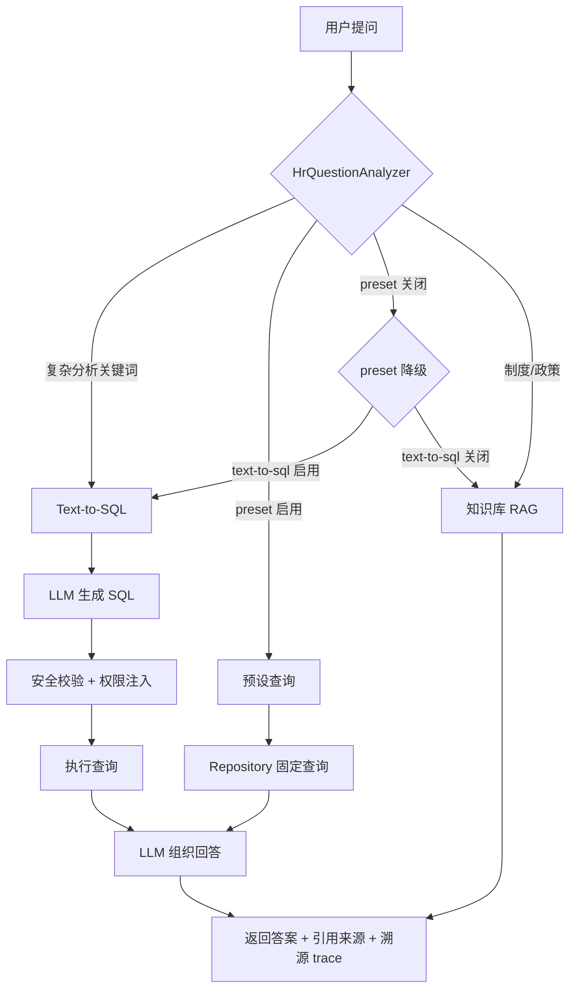

# HR AI 智能平台

企业级 HR 智能问答与预测分析系统。支持制度知识 RAG 问答、业务数据库实时查询（预设查询 / Text-to-SQL）、指定员工问数，以及管理者预测仪表盘与决策报告。

> 仓库结构：`hr-service-ai`（Spring Boot 后端）+ `hr-admin-ai`（Vue 3 前端）

## 能力概览

| 层级 | 能力 | 技术方案 |
|------|------|----------|
| 核心能力层 | 员工自助查询、制度问答、指定员工问数、管理者决策支持 | RAG + 预设查询（可选）+ Text-to-SQL |
| 进阶价值层 | 离职风险、技能缺口、招聘质量分析 | 预测数据 + LLM 解读 |
| 工程落地层 | 权限控制、数据隔离、问数溯源、连接池监控 | Spring Security + Druid + RBAC |

## 技术栈

| 模块 | 技术 |
|------|------|
| 后端 | Spring Boot 3.2、Java 17、Spring Security、JPA |
| 数据库 | MySQL 8.0 + **Druid** 连接池 |
| 大模型 | 通义千问 Qwen-Plus（OpenAI 兼容 API） |
| 前端 | Vue 3、Vite、Element Plus、Pinia、Axios |

## 项目结构

```
hr_ai/
├── hr-service-ai/              # Spring Boot 后端
│   ├── src/main/java/com/hr/ai/
│   │   ├── controller/         # REST API（Auth / Chat / Analytics / Knowledge）
│   │   ├── service/            # 业务逻辑（RAG、LLM、预测、HR 查询）
│   │   │   ├── HrQuestionAnalyzer.java   # 意图路由编排（LLM + 规则兜底）
│   │   │   ├── intent/         # LlmIntentAnalyzer / RuleBasedIntentAnalyzer
│   │   │   ├── HrDataQueryService.java   # 预设查询执行
│   │   │   └── texttosql/      # Text-to-SQL（Prompt / 安全 / 执行）
│   │   ├── security/           # JWT 认证 + 角色权限
│   │   ├── config/             # 配置与数据初始化
│   │   └── model/              # 平台表 + biz_* 业务表实体
│   ├── docs/
│   │   └── 业务测试用例.md      # 全场景测试用例（170 条）
│   └── scripts/mysql/
│       └── hr_test_data.sql    # MySQL 业务测试数据脚本
└── hr-admin-ai/                # Vue 3 前端
    └── src/
        ├── views/              # 问答、分析、报告、知识库
        ├── api/                # Axios 封装
        ├── stores/             # Pinia 用户状态
        └── router/             # 路由与权限守卫
```

## 快速启动

### 环境要求

- JDK 17+
- Maven 3.8+
- Node.js 18+
- MySQL 8.0+

### 1. 准备数据库

**方式 A — 导入完整测试数据（推荐）**

```bash
cd hr-service-ai
mysql -u root -p < scripts/mysql/hr_test_data.sql
```

脚本会自动创建 `hr_ai` 库，并写入 `biz_*` 业务表及演示数据。

**方式 B — 仅创建空库（业务数据由应用自动初始化）**

```sql
CREATE DATABASE hr_ai DEFAULT CHARACTER SET utf8mb4 COLLATE utf8mb4_unicode_ci;
```

应用启动后，`DataInitializer` 会写入登录用户与知识库；`BizDataInitializer` 在 `biz_employee` 为空时自动加载演示业务数据。

### 2. 配置数据库连接

编辑 `hr-service-ai/src/main/resources/application.yml`：

```yaml
spring:
  datasource:
    url: jdbc:mysql://localhost:3306/hr_ai?useSSL=false&serverTimezone=Asia/Shanghai&characterEncoding=utf8&allowPublicKeyRetrieval=true
    username: root
    password: 你的密码
```

### 3. 配置大模型（可选）

未配置 API Key 时自动使用 Mock 模式（本地模板回答，路由与数据逻辑不变）。

```powershell
# Windows PowerShell
$env:LLM_API_KEY="sk-你的API密钥"
```

或在 `application.yml` 中设置 `hr.ai.llm.api-key`（生产环境建议使用环境变量，勿提交密钥）。

### 4. 启动服务

```bash
# 后端（端口 8080）
cd hr-service-ai
mvn spring-boot:run

# 前端（端口 5173）
cd hr-admin-ai
npm install
npm run dev
```

| 服务 | 地址 |
|------|------|
| 前端 | http://localhost:5173 |
| 后端 API | http://localhost:8080 |
| Druid 监控 | http://localhost:8080/druid/ （admin / admin123） |
| 健康检查 | http://localhost:8080/api/health |

## 演示账号

| 角色 | 用户名 | 密码 | 员工编号 | 权限 |
|------|--------|------|----------|------|
| 普通员工 | employee1 | 123456 | E001 张三 | 智能问答、本人数据查询 |
| 部门经理 | manager1 | 123456 | E002 李四 | + 预测分析、决策报告（本部门） |
| HRBP | hrbp1 | 123456 | E003 王五 | + 全公司 HR 数据（含薪酬） |
| 管理员 | admin | 123456 | E000 | + 知识库管理 |

## 智能问答：意图路由

用户提问后，由 `HrQuestionAnalyzer` 作为**前置路由器**选择数据通路。默认通过**大模型**识别意图与槽位（员工姓名、查询主题），未配置 API Key 或识别失败时自动回退到规则引擎。

```
用户提问
  → LlmIntentAnalyzer（大模型 JSON 意图识别）
  → 失败/Mock 时 RuleBasedIntentAnalyzer（规则兜底）
  → applyRoutingPolicy（preset / text-to-sql 开关、复杂分析 gate）
  ├─ KNOWLEDGE        → 知识库 RAG
  ├─ PRESET_QUERY     → 固定 Repository 查询（preset 启用时）
  └─ TEXT_TO_SQL      → LLM 生成 SQL
```

### 意图路由器配置

```yaml
hr:
  ai:
    intent-router:
      mode: llm              # llm（默认）| rule（仅规则，测试/降级）
      fallback-to-rule: true # LLM 失败时回退规则引擎
      temperature: 0.1
```

| mode | 行为 |
|------|------|
| `llm` | 调用 Qwen 输出 JSON：`intent` / `employeeName` / `employeeTopic` |
| `rule` | 仅用关键词+正则规则（单元测试、无 API Key 时的 Mock 模式） |

### 原规则路由（兜底逻辑）

当 `mode=rule` 或 LLM 不可用时，仍按**优先级**路由：

```
用户提问
  ├─ ① 复杂分析关键词（对比/排名/超过/各部门…）  → Text-to-SQL（若启用）
  ├─ ② 本人查询（我的…）                         → 个人预设查询（若 preset 启用）
  ├─ ③ 指定员工查询（张三的假期 / 张三假期）      → 指定员工预设查询（若 preset 启用）
  ├─ ④ 部门/公司关键词 + 管理者角色              → 部门/公司预设查询（若 preset 启用）
  └─ ⑤ 制度/政策类                               → 知识库 RAG
```

### 三条数据通路

| 路径 | routeType | 触发示例 | 说明 |
|------|-----------|----------|------|
| 知识库 RAG | `KNOWLEDGE` | 年假怎么申请、五险一金怎么缴 | 检索 `knowledge_documents`，LLM 组织回答 |
| 预设查询 | `PRESET_QUERY` | 我的加班时长、张三假期、部门离职风险 | 关键词 + Repository 固定查询（需开启 preset） |
| Text-to-SQL | `TEXT_TO_SQL` | 对比各部门加班排名、绩效 C 且加班 > 50h | LLM 生成 SQL + 安全校验 + 自纠错 |

### 预设意图一览（15 种）

| 意图 | 示例问题 | 适用角色 |
|------|----------|----------|
| `KNOWLEDGE` | 年假有多少天？ | 全部 |
| `PERSONAL_*` | 我的假期余额 / 我的加班时长 | 全部（查本人） |
| `NAMED_EMPLOYEE` | 张三的假期、赵六的加班、查询张三的工资 | 经理+ / 本人 |
| `DEPT_*` | 统计部门加班、部门在职人数、离职风险员工 | 经理+ |
| `COMPANY_OVERVIEW` | 公司 HR 整体概览 | 经理+ |
| `TEXT_TO_SQL` | 对比各部门加班时长、找出加班超过 50 小时的员工 | 经理+ |

### 指定员工查询（NAMED_EMPLOYEE）

支持按姓名查询单个员工的业务数据，覆盖 8 个主题：薪酬、假期、加班、考勤、绩效、离职风险、满意度、档案。

**支持的表述：**

| 格式 | 示例 |
|------|------|
| `姓名 + 的 + 主题` | 张三的假期、赵六的加班时长 |
| `姓名 + 主题`（无「的」） | 张三假期、赵六加班 |
| `问/查 + 姓名 + …` | 问张三的假期、查张三工资 |

**不会误判为指定员工的情况：** 含「部门 / 统计 / 对比 / 平均 / 公司」等聚合词时，仍走部门或公司级查询。

**权限：** 查询前校验 `checkEmployeeAccess`；普通员工无法查他人；经理仅可查本部门员工；HRBP/管理员可查全公司。

### 预设查询开关（preset-query）

默认**不启用**预设查询，业务问数优先走 Text-to-SQL：

| preset-query | text-to-sql | 原 preset 类问题（如「我的加班」「张三假期」） |
|--------------|-------------|-----------------------------------------------|
| `false`（默认） | `true` | 降级为 **Text-to-SQL** |
| `false` | `false` | 降级为 **RAG 知识库** |
| `true` | — | 走原有预设 Repository 查询 |

制度/政策类问题不受 preset 开关影响，始终走 RAG。

```yaml
hr:
  ai:
    preset-query:
      enabled: false   # 改为 true 启用固定预设查询
```

### Text-to-SQL 路由 gate

Text-to-SQL **执行**由 LLM 完成，但**是否走该路径**由规则 gate（`shouldUseTextToSql`）决定：仅当问题含复杂分析关键词（对比、排名、超过、各部门、排序等）时才触发。简单数据问句在 preset 启用时走预设，preset 关闭时降级为 Text-to-SQL。

## 业务数据表（biz_*）

| 表名 | 内容 |
|------|------|
| `biz_department` | 部门信息 |
| `biz_employee` | 员工档案 |
| `biz_attendance` | 考勤汇总（当前季度 2026-Q1） |
| `biz_salary` | 薪酬数据（敏感，仅 HRBP/管理员） |
| `biz_performance` | 绩效记录 |
| `biz_turnover_risk` | 离职风险预测 |

## 核心 API

| 接口 | 方法 | 说明 | 权限 |
|------|------|------|------|
| `/api/auth/login` | POST | 登录 | 公开 |
| `/api/auth/me` | GET | 当前用户信息 | 已登录 |
| `/api/chat/ask` | POST | 智能问答（同步） | 已登录 |
| `/api/chat/ask/stream` | POST | 智能问答（SSE 流式） | 已登录 |
| `/api/chat/sessions` | GET | 会话列表 | 已登录 |
| `/api/chat/sessions/{id}/messages` | GET | 会话消息 | 已登录 |
| `/api/employees/{id}/profile` | GET | 员工 360° 档案 | 按员工权限 |
| `/api/employees/by-name/{name}/profile` | GET | 按姓名查档案 | 按员工权限 |
| `/api/analytics/dashboard` | GET | 预测分析仪表盘 | 管理者+ |
| `/api/analytics/turnover` | GET | 离职风险 | 管理者+ |
| `/api/analytics/skill-gaps` | GET | 技能缺口 | 管理者+ |
| `/api/analytics/recruitment` | GET | 招聘质量 | 管理者+ |
| `/api/reports/generate` | POST | 管理者决策报告 | 管理者+ |
| `/api/knowledge` | CRUD | 知识库管理 | 管理员 |
| `/api/health` | GET | 健康检查 | 公开 |

流式问答事件顺序：`trace` → `chunk`（多条）→ `done`。

## 架构说明

### 问答流程



### Text-to-SQL 安全链

Text-to-SQL 的用户查询安全由应用层独立保障（不依赖 Druid WallFilter）：

1. 仅允许 `SELECT`，白名单 6 张 `biz_*` 表
2. 禁止 DML/DDL/UNION/注释
3. 自动注入角色级 `employee_id` / `dept_id` 过滤
4. 强制 `LIMIT` 上限（默认 50 行）
5. SQL 执行失败时 LLM 自纠错重试（默认 2 次）
6. 普通员工非本人查询在路由层禁止进入 Text-to-SQL
7. 统计类问题 Prompt 强制 `COUNT/SUM/AVG/GROUP BY`，避免拉全表明细

### 防幻觉（Anti-Hallucination）

| 机制 | 说明 |
|------|------|
| RAG 置信度门槛 | top-1 相似度 < `min-confidence-for-answer` 时直接拒答，不调 LLM |
| 关闭低分兜底 | `low-score-fallback-enabled: false`，禁止强行返回弱相关文档 |
| 结构化直出 | DB 查询结果 ≤ 20 行时模板直出，不经 LLM 润色 |
| 数字校验 | LLM 润色后校验答案数字是否均来自查询结果，否则回退模板 |
| Guard 直出 | 权限拦截类回答始终模板输出 |
| 聚合优先 | Text-to-SQL Prompt 要求统计在数据库内完成 |

```yaml
hr:
  ai:
    rag:
      top-k: 3
      similarity-threshold: 0.15
      min-confidence-for-answer: 0.15
      low-score-fallback-enabled: false
    anti-hallucination:
      skip-llm-for-structured-data: true
      structured-data-max-rows: 20
      validate-answer-numbers: true
    text-to-sql:
      max-rows: 50
    llm:
      temperature: 0.1
```

### 预测分析

当前为演示数据（`DataInitializer` 种子），生产环境可对接 XGBoost / 随机森林等 ML 模型：

- **离职风险**：综合绩效、考勤、满意度等维度评分
- **技能缺口**：岗位技能供需与缺口分析
- **招聘质量**：成功入职者特征与优化建议

### 安全与权限

- JWT 无状态认证
- 基于角色的访问控制（RBAC）：EMPLOYEE / MANAGER / HRBP / HR_ADMIN
- 部门级数据隔离（经理仅看本部门）
- 指定员工查询与员工档案 API 均校验 `checkEmployeeAccess`
- 薪酬等敏感字段额外权限校验（经理不可见薪酬明细）

## 配置参考

### 大模型（通义千问）

| 配置项 | 默认值 | 说明 |
|--------|--------|------|
| `hr.ai.llm.provider` | `qwen` | `qwen` 或 `mock` |
| `hr.ai.llm.api-key` | 环境变量 `LLM_API_KEY` | 未配置时回退 Mock |
| `hr.ai.llm.model` | `qwen-plus` | 可改为 `qwen-max` 等 |
| `hr.ai.llm.temperature` | `0.3` | 越低越稳定 |

获取 API Key：[阿里云百炼控制台](https://bailian.console.aliyun.com/) → API-KEY 管理

### Text-to-SQL

| 配置项 | 默认值 | 说明 |
|--------|--------|------|
| `hr.ai.text-to-sql.enabled` | `true` | 是否启用 |
| `hr.ai.text-to-sql.max-rows` | `50` | 单次最大返回行数 |
| `hr.ai.text-to-sql.few-shot-enabled` | `true` | Prompt 中包含示例 SQL |
| `hr.ai.text-to-sql.self-correction-enabled` | `true` | 执行失败时 LLM 自纠错 |
| `hr.ai.text-to-sql.max-retries` | `2` | 自纠错最大重试次数 |

### 预设查询

| 配置项 | 默认值 | 说明 |
|--------|--------|------|
| `hr.ai.preset-query.enabled` | `false` | 是否启用个人/指定员工/部门/公司预设查询 |

### Druid 连接池

| 配置项 | 默认值 | 说明 |
|--------|--------|------|
| `spring.datasource.type` | `DruidDataSource` | 数据源连接池 |
| `spring.datasource.druid.max-active` | `30` | 最大连接数 |
| `spring.datasource.druid.stat-view-servlet.enabled` | `true` | 开启监控页面 |

### HR 系统集成（可选）

```yaml
hr:
  ai:
    integration:
      enabled: true
      provider: beisen    # sap / beisen / moka
      base-url: https://your-hr-system.com/api
```

默认关闭，数据直接来自 MySQL `biz_*` 表。

## 测试

完整业务测试用例见 [`docs/业务测试用例.md`](docs/业务测试用例.md)（170 条，覆盖默认 Text-to-SQL 路由、指定员工、preset 双模式、权限、溯源等）。

单元测试（意图路由 + SQL 安全）：

```bash
cd hr-service-ai
mvn test -Dtest=HrQuestionAnalyzerTest,SqlSecurityValidatorTest
```

推荐冒烟顺序（默认配置）：`AUTH-01` → `RAG-01` → `PER-01` → `DEPT-01` → `SQL-01`

## 常见问题

**Q: 启动报「未找到员工 E00x」？**

确保 `biz_employee` 有数据：导入 `scripts/mysql/hr_test_data.sql`，或清空业务表后重启让 `BizDataInitializer` 自动初始化。

**Q: 启动报 DDL / CLOB 相关错误？**

确认使用 MySQL 8.0+，且数据库为 `hr_ai`。若之前启动失败留下不完整表结构，建议 `DROP DATABASE hr_ai` 后重建。

**Q: 问「张三假期」却返回知识库政策说明？**

1. 确认 `hr.ai.preset-query.enabled=true`，或 `hr.ai.text-to-sql.enabled=true`（默认 preset 关闭时依赖 Text-to-SQL）
2. 确认已配置 Qwen API Key（Mock 模式对简单问句模板覆盖有限）
3. 表述需含员工姓名 + 主题词，如「张三假期」「张三的假期」

**Q: 问答没有走数据库，只查了知识库？**

- 默认 preset 关闭：简单数据问句需 Text-to-SQL 启用且 LLM 可用
- 制度类问题（无数据关键词）始终走 RAG
- 普通员工查他人数据会被拦截，降级为 RAG 或提示无权

**Q: Text-to-SQL 回答不准确？**

确认已配置 Qwen API Key（Mock 模式仅支持少量预设 SQL 模板）。复杂问题建议用 manager1 或 hrbp1 账号测试。

**Q: preset 与 Text-to-SQL 如何搭配？**

| 场景 | 推荐配置 |
|------|----------|
| 生产稳定优先 | `preset-query.enabled=true`，简单问句走固定查询 |
| LLM 能力优先（当前默认） | `preset-query.enabled=false`，业务问句走 Text-to-SQL |
| 仅制度问答 | 两者均 `false`，仅 RAG |

## 生产部署建议

1. MySQL 主从或云数据库，关闭 `ddl-auto: update`，改用 Flyway/Liquibase 管理表结构
2. 向量库升级为 Milvus / pgvector，替换当前 Jaccard 轻量检索
3. LLM 使用企业级 API 或私有化部署；API Key 通过环境变量注入
4. 修改 JWT Secret、Druid 监控密码，启用 HTTPS
5. 对接企业 SSO（LDAP / OAuth2）
6. Text-to-SQL 生产环境建议接入 SQL 审计日志
7. 根据场景显式配置 `preset-query.enabled` 与 `text-to-sql.enabled`，避免依赖默认组合
